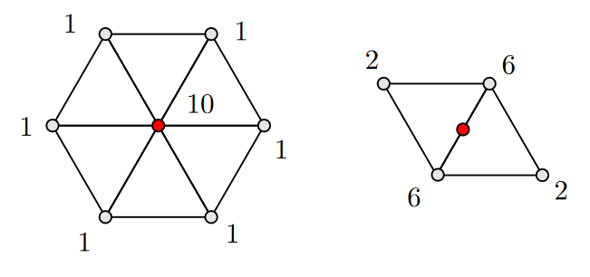
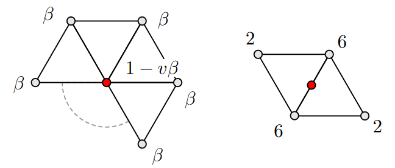
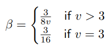

# loop subdivision

Implementation of loop subdivision using the following stencils

Startup view with disabled unused ui elements

The following images show a Tetrahedron wireframe visual subdivided in zero to 4 steps

Tetrahedron after 4 subdivision steps displayed with phong shading

Tetrahedron after 4 subdivision steps displayed with isophotes shading

Isophotes with higher frequency

The following images show a Open Cube wireframe visual subdivided in zero to 4 steps

Open Cube with phong shading

Isophotes for the Open Cube

