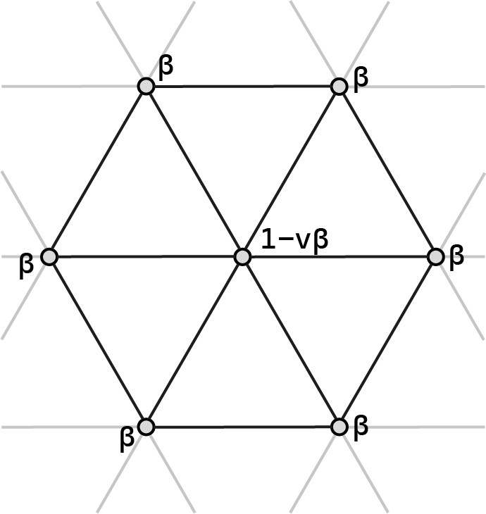
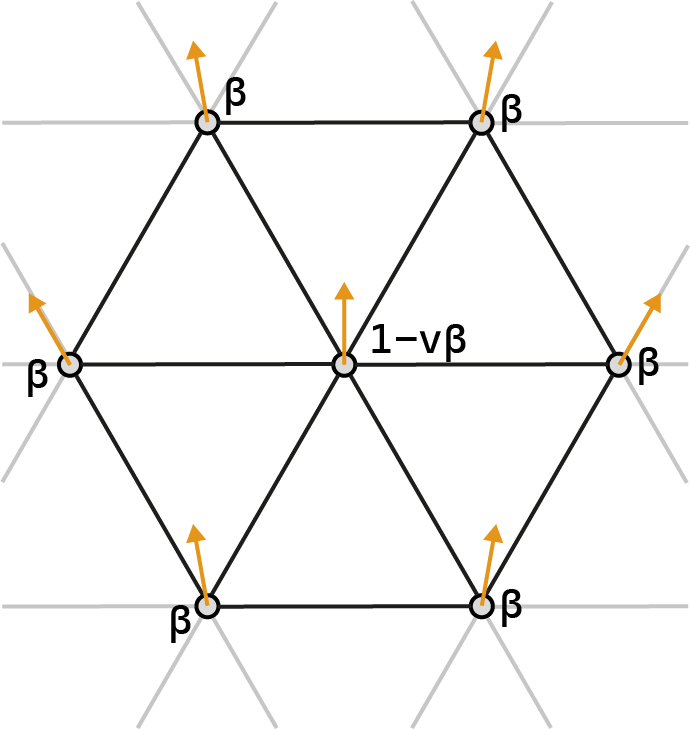
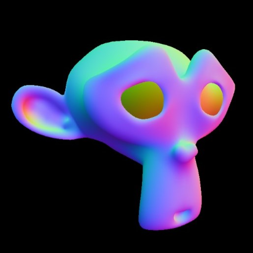

# Loop subdivision

The following images show the stencils used to compute the new position in the geometry refinement stage. On the left the stencil is shown, the new vertex position depends on the weights of neighboring vertices in the old topology. The vertex in question to be positions is show on the right in the new topology. There are 4 different cases:  

Vertex point that exists both in the new and old topology (β = v!=3 ? 3/8v : 3/16): 
 
 
Vertex point that exists both in the new and old topology, located on the boundary of the mesh: 
 
 
Vertex point that was just created in the topology refinement: 
 
 
Vertex point that was just created in the topology refinement, located on the boundary of the mesh: 
 
 

# Phong shading
Normal-vector interpolation shading (Phong) uses the formula to compute light intensities: I = ka + kd (L dot N) + ks (R dot V)α.  Interpolation of normals shown on the left, vectors used on the right: 
 
 

# Subdivision shading
The following images show steps involved to redirect all the normals in the mesh to an orientation that is continues relative to its neighbors. 
 
Applying the loop subdivision stencil to vertex normals: 
 
 
The orthogonal plane projection in theory comes down to the following. Each neighboring normal is set to a similar origin point. All of these normals are going to be projected on the plane orthogonal to the normal being computed. The projection is essentially the shadow that falls on the plane as an infinitely far away light source shines directly onto the plane: 
 
 
Compute a weighted average of projected normals: 
 
 
Tilt normal in question on axis nk ×  ̃nk+1: 
 

 
 
 
 
 
 
 
 
 
 
 
 
 
 
 
 
 
 
 
 
 
 
 
